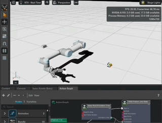

# brownbotics_dev environment
Development repository for brownbot 

# Preliminary results

Robot has learnt by itself to reach the object but it is struglling to grasp it. The development was done using isaac sim to create the robot and isaac lab for training the robot using PPO algorithm for reinforcement learning.

Training:


Result:


Inverse Kinematics using ROS2 Humble:



# Install IsaacLab for isaac sim 4.2

In order to install IsaacLab, some modification were needed it in the submodule. The version compatible with the isaac-sim container is the v1.4.1

There were some problems when trying to install the rsl_rl packages: 

## Change in the isaaclab.sh 

This script needs to be modified in the following lines: 

```sh
# install the rl-frameworks specified
${python_exe} -m pip install --upgrade pip
${python_exe} -m pip install git+https://github.com/leggedrobotics/rsl_rl.git
${python_exe} -m pip install -e ${ISAACLAB_PATH}/source/extensions/omni.isaac.lab_tasks["${framework_name}"]

```

## Change in the setup.py of the lab_tasks

The setup.py is located in: IsaacLab/source/extensions/omni.isaac.lab_tasks 

and the rsl-rl line needs to be modifying as follows:  

```python

# Extra dependencies for RL agents
EXTRAS_REQUIRE = {
    "sb3": ["stable-baselines3>=2.1"],
    "skrl": ["skrl>=1.3.0"],
    "rl-games": ["rl-games==1.6.1", "gym"],  # rl-games still needs gym :(
    #"rsl-rl": ["rsl-rl@git+https://github.com/leggedrobotics/rsl_rl.git"],
    "rsl-rl": ["rsl-rl-lib"],
    "robomimic": [],
}

```

Once this is modified the container can be built successfully

# Build containers 

## Isaac-sim 4.2

The dockefile, doing the corresponding set up for the container, is located in ./docker/isaac-ros/ 

In order to build the previous dockerfile, we should use the following command 

```
docker-compose build isaac-ros 
```

or without cache

```
docker-compose build --no-cache isaac-ros 
```

Some of the dockerfile and docker compose configuration variables are organized in the .env file 

## Isaac-sim 4.5

The dockerfile for this container is in the ./docker/isaac-ros-v2/Dockerfile location

This container can be built by running the following docker compose commands

```
docker compose build isaac-ros-v2
```

or without cache

```
docker compose build --no-cache isaac-ros-v2
```

The variables used in the docker compose file and the dockerfile are included in the .env.isaac4.5 file

# Running the containers 

## Isaac-sim 4.2

```
docker-compose run isaac-ros
```

## Isaac-sim 4.5

```
docker compose up -d isaac-ros-v2
```

Detach mode (-d) is required to avoid getting inside the container in the current terminal

# Execute Normal Inverse Kinematics ROS2 Package 

This solution is based in the package from: https://github.com/caiobarrosv/ur5_isaac_simulation 

Currently, it is working only in the Isaac-sim 4.2 container which has ROS2 Humble installed

The purpose of doing this, is to verify that the robot is able to reach the object and grasp it. Then, we will be sure that the reinforcement learning approach will work:


Then, before runnning any of the nodes, the brownbotics workspace needs to be source with the following command: 

```
echo 'export LD_LIBRARY_PATH=$(echo $LD_LIBRARY_PATH | sed "s|/isaac-sim/exts/omni.isaac.ros2_bridge/humble/lib:||g")' >> ~/.bashrc
echo 'source /isaac-sim/workspaces/isaac_sim_ws/install/setup.bash' >> ~/.bashrc  
```

Install some ROS2 dependencies: 

```
sudo apt update

sudo apt install ros-humble-vision-msgs ros-humble-control-msgs   ros-humble-tf-transformations ros-humble-joint-state-publisher   ros-humble-xacro
```

And the following needs to be executed by terminal: 

```
ros2 launch brownbot_ik ur5_isaac_ros2.launch.py
```

```
ros2 run brownbot_ik ur5_isaac_ros2
```

```
ros2 run arm_move1 brownbot_ik_seq_node
```

